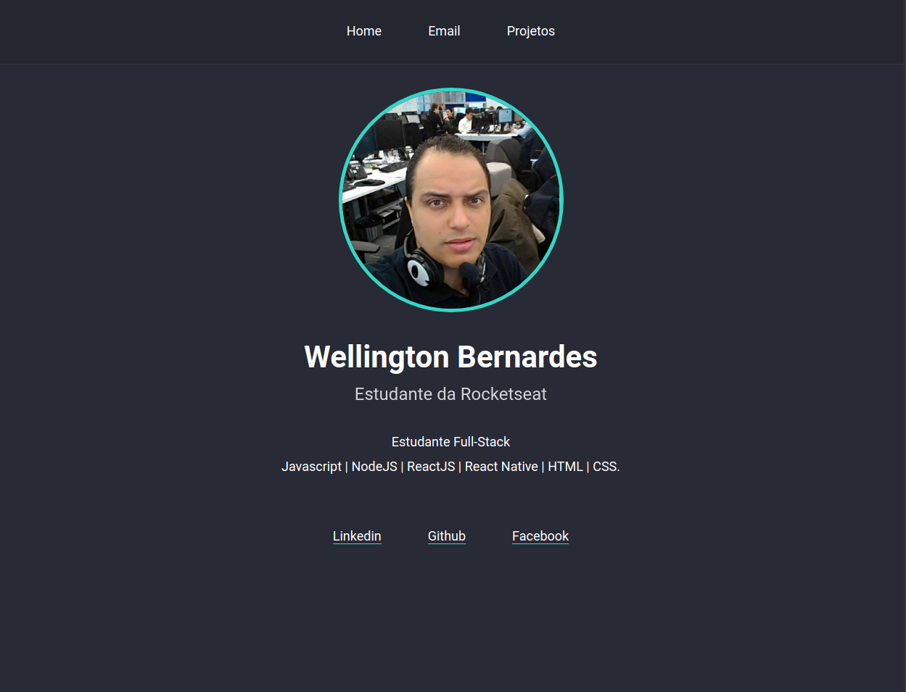

<h1 align="center">
  Projeto de site pessoal
</h2>

    

  
  

 

## 💻 O Projeto
Site desenvolvido durante o LaunchBase da [RocketSeat](https://rocketseat.com.br/) com o objetivo de aplicar os conhecimentos das tecnologias aprendidas.

## ☕ Funcionalidades
- Aplicar os conhecimentos de Javascript | HTML | CSS e mostrar o portifólio no site.

## :rocket: Tecnologias usadas
Este projeto foi desenvolvido com as seguintes tecnologias:
- :u6708: **Javascript**
- :u7533: **HTML5**
- :u6709: **CSS**

## :memo: Licença

Esse projeto está sob a licença MIT. Veja o arquivo [LICENSE](LICENSE.md) para mais detalhes.

---

Feito com ❤️ by Wellington Bernardes :wave: